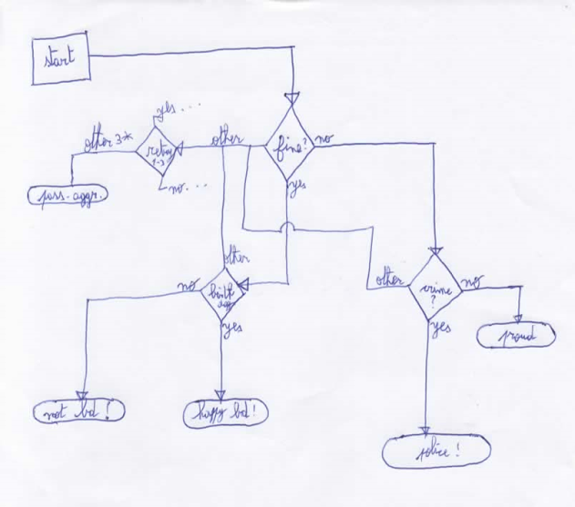
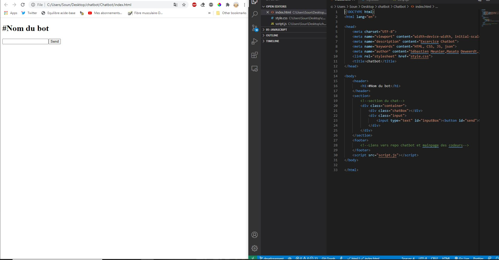
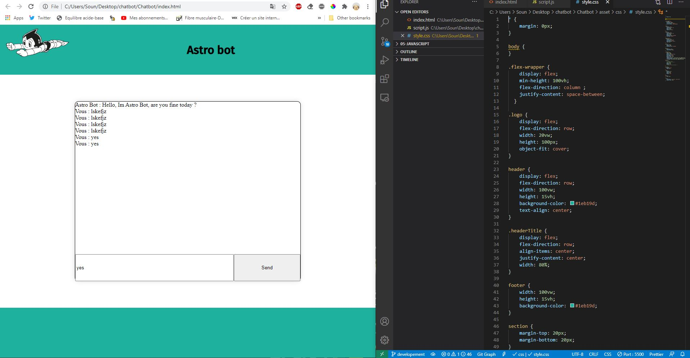
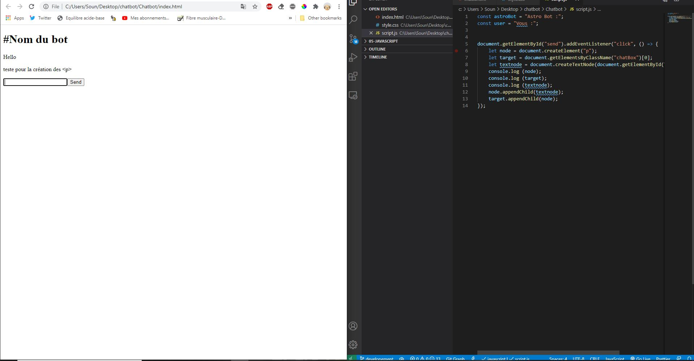

# Chatbot

## Introduction

Dans ce repository vous trouverez un chatbot basique codé en équipe de trois sur 3 jours.  
Il s'agit d'un challenge réalisé lors de la formation chez BeCode.

## Langages utilisés

+ HTML5
+ CSS3  
+ JS
+ JSON

## Responsive

implémenté via MediaQueries

## Team

+ [Masato Deweerdt](https://github.com/masatoDeweerdt)
+ [Sébastien Meunier](https://github.com/MeunierS)
+ [Soufiane El kabir](https://github.com/soufianecode)

## Liens vers la page  

[Içi](https://soufianecode.github.io/Chatbot/)  

## Progression

Début : 15/07/2020

v1.0 : 16/07/2020  

## Historique

+ 15/07/2020 10h30 : création du readme, initialisation du repo et des fichiers basiques.
+ 16/07/2020 9h15 : html css et js fini pour version de test basique.

## Poste occupé durant la Réalisation

+ Junior Web Dev chez Becode

## Flowchart de l'IA

## Screenshots durant le développement

## Credits

Osamu Tezuka for Astro Boy